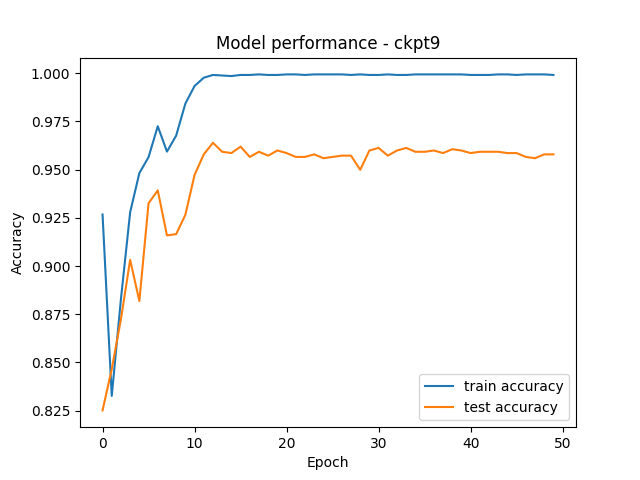
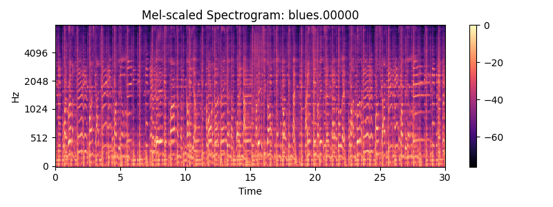

# References

> > This project would not be possible without the contributions of many engineers and researchers before us.

The main paper that this implementation references and attributes credit to is:

- [Adiyansjaha, Alexander A S Gunawana, Derwin Suhartono: Music Recommender System Based on Genre Using Convolutional Recurrent Neural Networks](https://www.sciencedirect.com/science/article/pii/S1877050919310646)

Different implementations in the wild/pre-processing references:

- [taylorhawks/RNN-music-recommender](https://github.com/taylorhawks/RNN-music-recommender)
- [Roberts, Leland: Understanding the Mel-Spectrogram](https://medium.com/analytics-vidhya/understanding-the-mel-spectrogram-fca2afa2ce53)

## Repository Structure

- [checkpoints](https://github.com/phasewalk1/cayde/tree/master/checkpoints) contains the saved model weights outputted at the end of each training solstice.

- [example-train](https://github.com/phasewalk1/cayde/tree/master/example-train) contains example training data used for development and proof of concept research.
- [mel](https://github.com/phasewalk1/cayde/tree/master/mel) is the directory that holds the output images of Mel-scaled spectrograms computed in the preprocessor.
- [models](https://github.com/phasewalk1/cayde/tree/master/models) defines the various models implemented for the `cayde` system architecture.
- [perf](https://github.com/phasewalk1/cayde/tree/master/perf) stores performance related statistical figures, such as train/test accuracy as a function of epoch over an entire solstice period.
- [wrangling](https://github.com/phasewalk1/cayde/tree/master/wrangling) defines multiple classes used in the preprocessing stage of the data pipeline, such as the `MelSpectrogramBuilder`, `MFCCBuilder`, `BatchEncoder`, and the main class that performs a run through the entire pipeline, `Wrangler`. This directory also defines multiple utilities used in development such as the `Viewer` class which handles logging, and the `setfetch` script which uses the _Kaggle_ API to pull and unzip the full GTZAN dataset into the workspace.
- [ikora.py](https://github.com/phasewalk1/cayde/tree/master/ikora.py) is the command-line interface into `Wrangler`, and is useful for running through the full pipeline in various modes, e.g. `['mfcc', 'encode']`
- [main.py](https://github.com/phasewalk1/cayde/tree/master/main.py) is the core training script that utilizes the `Trainer` defined in [trainer.py](https://github.com/phasewalk1/cayde/tree/master/trainer.py) to run batches of training solstices (train for `SOLSTICE * EPOCHS` epochs) while outputting the checkpoints of model weights at the end of each solstice.

### [Sundance](https://github.com/phasewalk1/cayde/tree/master/sundance)

In explaining the repository structure above, you may have noticed that we elided the `sundance` directory. This is because it deserves an explanation of its own. `sundance` is a Rust crate that aims to handle the heavy lifting of the data pipeline so as to speed up the preprocessing while development is still under way. `sundance` currently provides only one workflow, computing batches of _one-hot encoded_ pixel arrays from the Mel-scaled spectrograms within [mel](https://github.com/phasewalk1/cayde/tree/master/mel). While plans are made to continue porting preprocessors from [wrangling](https://github.com/phasewalk1/cayde/tree/master/wrangling) over to [sundance](https://github.com/phasewalk1/cayde/tree/master/sundance), it is largely the most complex stage of development and thus, may remain largely unstable for the foreseeable future. Workflows that we desire to implement in Rust instead of Python include, but are not limited to:

- [x] _batch encoding (via one-hot)_ Mel-scaled Spectrograms
- [ ] _batch builder_ for Mel-scaled Spectrogram dumps
- [ ] _batch computing MFCCs_ and extracting semantic labels from GTZAN

## Development Status

The `cayde` system is in very early stages of development and is currently in its research stage. Primary focus of development is data processing and normalization, whilst also continuing research into the various references listed along others which may or may not be added to the above list in the future. Below are some figures of the alternative implementations being tested. This implementation differs from the architectures implemented in the paper referenced above, primarily in it accepting as inputs the Mel-frequency Cepstral Coefficients instead of one-hot-encoded spectrogram pixels. The model below is a Binary Classifier for genre classification, and was trained on the full GTZAN dataset, whilst only a reduced version of it is included in the repository [here](https://github.com/phasewalk1/cayde/tree/master/example-train/GTZAN-reduced).



## About Preprocessing

`cayde` is trained on the Mel-scaled spectrograms and MFCCs (Mel-frequency Cepstral Coefficients) of the segmented audio files. We segment each audio file into 5 segments each, allowing us to increase the execution time of the preprocessing whilst simultaneously, increasing the number of data points in our training/hold-out sets. We extract the MFCCs from each segment, and use the development training set to extract the provided semantic labels (see below) used for supervised learning. The file `data.json` is constructed as a result of running [wrangler.py](https://github.com/phasewalk1/cayde/tree/master/wrangling/wrangler.py), and is an example training set that contains the preprocessed labels, mappings, and MFCCs from a reduced version of the GTZAN dataset.

**Mel-scaled Spectrograms**

Below is an example spectrogram used for feature extraction in the Convolutional Recurrent net:


**Mel-frequency Cepstral Coefficients**

Here's an example of a MFCC batch computed via the `MFCCBuilder.segmented_batch_save_mfcc` method:

```json
"MFCCs": [
        [
            [
                -87.6069564819336,
                118.83728790283203,
                -14.530750274658203,
                8.882493019104004,
                5.562922954559326,
                -18.97341537475586,
                11.625785827636719,
                15.937507629394531,
                19.477306365966797,
                9.90665054321289,
                2.2180898189544678,
                -0.5555779337882996,
                0.2503119111061096
            ],
            [
                -63.46507263183594,
                121.4153060913086,
                -10.391878128051758,
                9.364693641662598,
                15.433528900146484,
                -18.69662857055664,
                11.500993728637695,
                7.160057544708252,
                15.920083999633789,
                8.458211898803711,
                5.4518303871154785,
                2.2130210399627686,
                -0.7875062823295593
            ],
            ...
        ]
]
```

## The [Dataset](https://www.kaggle.com/datasets/andradaolteanu/gtzan-dataset-music-genre-classification?resource=download) used for development (Proof of Concept)

As we begin building the model for a music recommendation system, we first need a way to extract features (such as genre) from segments of audio files. Since the application (SB) isn't ready to provide us with a training set, we utilize the GTZAN dataset that retains a directory structure such that genre labels can be easily extracted in order to perform supervised learning with the Binary Classifier model mentioned above.
